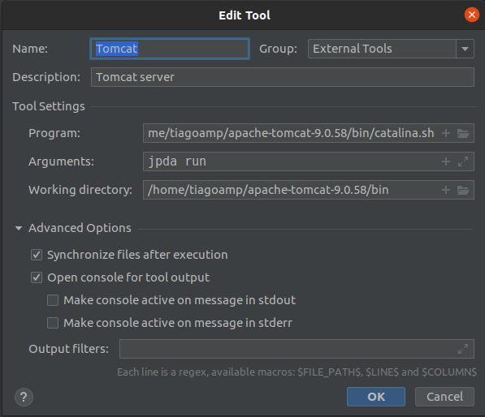
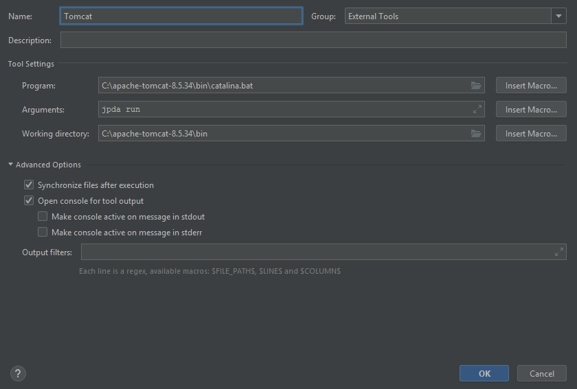
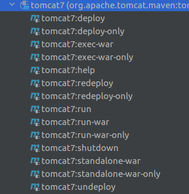

# Tomcat configuration

---

## Download

Versão utilizada: apache-tomcat-9.0.XX

Página de download: https://tomcat.apache.org/download-90.cgi

---

## Configuração

### Permissões de execução (se necessário)

Se precisar, atribuir permissões de executação para os scripts de inicialização e shutdown do Tomcat.

Diretório: apache-tomcat/bin

Para Windows, são so arquivos '.bat'

Exemplos: 

```
apache-tomcat-9.0.58/bin$ chmod +x catalina.sh
apache-tomcat-9.0.58/bin$ chmod +x startup.sh
apache-tomcat-9.0.58/bin$ chmod +x shutdown.sh
```

---


Adicionar bibliotecas no Tomcat (tempo de execução), no diretório '_apache-tomcat-9.0.58/lib_/':

- [jsf-api-2.2.20.jar](libs/jsf-api-2.2.20.jar)
- [jsf-impl-2.2.20.jar](libs/jsf-impl-2.2.20.jar)
- [jstl-1.2](libs/jstl-1.2.jar)
- [javax.annotation-api-1.3.2.jar](libs/javax.annotation-api-1.3.2.jar)

---

### Configuração no IntelliJ

Se quiser startar ou derrubar o servidor direto no IntelliJ, executar passos abaixo (configurar como 'External Tool..').

Senão pode executar os scripts pela linha de comando em separado, deixando o servidor 'up' quando for fazer o deploy da aplicação desenvolvida.

Artigo de origem: https://stefancosma.xyz/2018/10/01/how-to-use-tomcat-intellij-idea-community/

Menu File >> Settings e expandir '_Tools_' e selecionar '_External Tools_'. Clicar no '+' para adicionar config:

No Linux:



No Windows:



Desta forma deve ser possível administrar o servidor Tomcat de dentro da IDE.

---

### Habilitando Tomcat para deploy com Maven 

Artigo de origem: https://www.baeldung.com/tomcat-deploy-war

Criar permissões no arquivo _apache-tomcat/config/tomcat-users.xml_ :

```
<role rolename="manager-gui"/>
<role rolename="manager-script"/>
<role rolename="manager-jmx"/>
<role rolename="manager-status"/>
<user username="admin" password="password" roles="manager-gui, manager-script, manager-jmx, manager-status"/>
```

No arquivo de configuração do Maven (_.m2/settings.xml_ - criar se não existir), adicionar credenciais para acesso ao servidor Tomcat.

Exemplo:

```
  <servers>
    <server>
      <id>TomcatServer</id>
      <username>admin</username>
      <password>password</password>
   </server>
  </servers>
```

No arquivo _pom.xml_ da aplicação, adicionar o plugin do tomcat:

Exemplo:

```
      <plugin>
        <groupId>org.apache.tomcat.maven</groupId>
        <artifactId>tomcat7-maven-plugin</artifactId>
        <version>2.2</version>
        <configuration>
          <url>http://localhost:8080/manager/text</url>
          <server>TomcatServer</server>
          <path>/${project.artifactId}</path>
        </configuration>
      </plugin>
```

Devem aparecer as opções de execução Maven do Tomcat na aba 'maven' da IDE:


