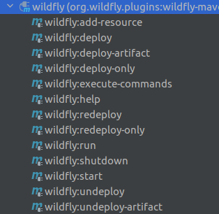

# Wildfly configuration

---

## Download

Versão utilizada: wildfly-26.0.1

Página de download: https://www.wildfly.org/downloads/

---

## Configuração

### Permissões de execução (se necessário)

Se precisar, atribuir permissões de executação para os scripts de inicialização e shutdown do Wildfly.

Diretório: wildfly/bin

Para Windows, são so arquivos '.bat'

Exemplos: 

```
windlfy-26.0.1.Final/bin$ chmod +x standalone.sh
windlfy-26.0.1.Final/bin$ chmod +x add-user.sh 
```

---

Criando usuário no WildFly para deploy:

Artigo de origem: https://jboss-books.gitbooks.io/wildfly/content/instalacao/criando_usuario_de_gerenciamento.html

Start do servidor local com o script '_standalone.sh_'.

Depois execute o script '_add-user.sh_', respondendo as perguntas que forem aparecendo no terminal, tais como nome do usuário e senha.

Crie como '_Management User_' e responda as demais perguntas como a opção default.

Depois acesse a página de adminstração do servidor com o usuário/senha criado para testar: http://127.0.0.1:9990

---

### Habilitando WildFly para deploy com Maven 

Artigo de origem: http://www.mastertheboss.com/jboss-frameworks/jboss-maven/configuring-maven-wildfly-plugin/

No arquivo _pom.xml_ da aplicação, adicionar o plugin do wildlfy:

Exemplo:

```
      <plugin>
        <groupId>org.wildfly.plugins</groupId>
        <artifactId>wildfly-maven-plugin</artifactId>
        <version>2.1.0.Final</version>
        <configuration>
          <filename>${project.build.finalName}.war</filename>
          <port>9990</port>
          <username>administrador</username>
          <password>senha</password>
        </configuration>
      </plugin>
```

Devem aparecer as opções de execução Maven do WildFly na aba 'maven' da IDE:


